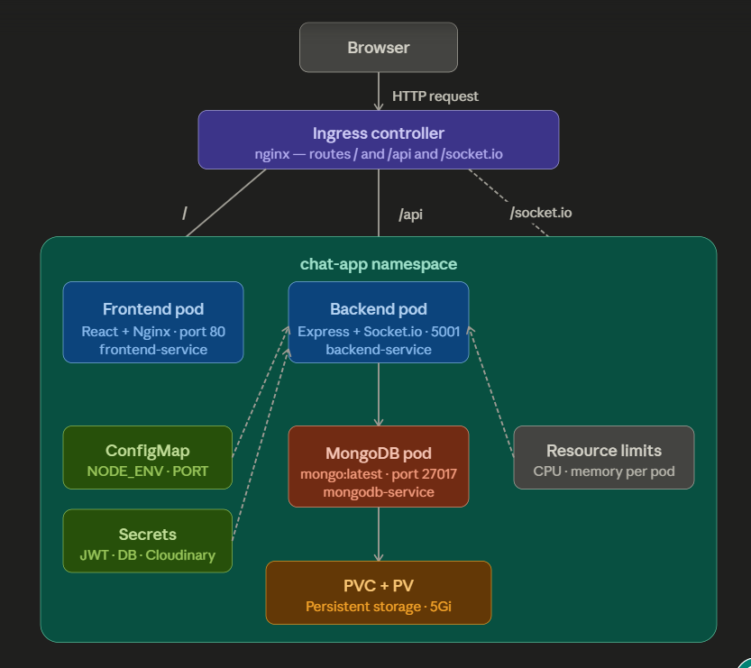

# Kubernetes Deployment — Varta Chat App

> Production-grade Kubernetes implementation for a full-stack real-time MERN chat application.

This repository contains complete Kubernetes manifests for deploying [Varta](https://github.com/Shubh823/FullStack-chatapp) — a real-time chat application built with React, Node.js, MongoDB, and Socket.io.

The goal of this project was to take an existing full-stack application and make it production-ready by implementing a complete Kubernetes infrastructure — covering namespace isolation, secrets management, persistent storage, resource limits, and ingress-based traffic routing.

## Architecture



The diagram above shows the complete Kubernetes infrastructure:

- **Ingress Controller** acts as the single entry point, routing `/` to the frontend and `/api`, `/socket.io` to the backend
- **Frontend Pod** serves the React app via Nginx on port 80
- **Backend Pod** runs the Express API and Socket.io server on port 5001
- **MongoDB Pod** handles data persistence, backed by a PersistentVolume
- **ConfigMap & Secrets** inject environment variables and sensitive credentials into pods


## Tech Stack

| Tool | Purpose |
|------|---------|
| Kubernetes | Container orchestration |
| Minikube | Local Kubernetes cluster |
| Docker | Containerization |
| Nginx | Frontend serving + Ingress controller |
| MongoDB | Database |
| Node.js + Express | Backend API |
| React | Frontend |
| Socket.io | Real-time communication |
## Features

- **3-tier architecture** — Frontend, Backend, and Database deployed as separate pods
- **Namespace isolation** — all resources scoped under `chat-app` namespace
- **Ingress routing** — single entry point routing traffic to frontend and backend services
- **Persistent storage** — MongoDB data retained across pod restarts using PV/PVC
- **Secrets management** — sensitive credentials stored securely using Kubernetes Secrets
- **ConfigMap** — non-sensitive environment variables managed separately from application code
- **Resource limits** — CPU and memory limits defined for all pods
- **Real-time support** — Socket.io WebSocket traffic routed through Ingress
## Prerequisites

Make sure you have the following installed before deploying:

- [Docker](https://www.docker.com/products/docker-desktop) — v20 or higher
- [Minikube](https://minikube.sigs.k8s.io/docs/start/) — v1.30 or higher
- [kubectl](https://kubernetes.io/docs/tasks/tools/) — v1.27 or higher

## Environment Variables

All sensitive credentials are stored in `k8s/secrets.yml`. Before deploying, replace the placeholder values with your own Base64-encoded secrets.

> A `k8s/secrets.example.yml` file is provided as a reference template. Copy it, rename it to `secrets.yml`, and fill in your own Base64-encoded values. Never commit `secrets.yml` to version control.

To encode a value:
```bash
echo -n "your-value" | base64
```

| Variable | Description |
|----------|-------------|
| `JWT_SECRET` | Secret key for JWT authentication |
| `MONGODB_URI` | MongoDB connection string |
| `MONGO_INITDB_ROOT_USERNAME` | MongoDB root username |
| `MONGO_INITDB_ROOT_PASSWORD` | MongoDB root password |
| `CLOUDINARY_CLOUD_NAME` | Cloudinary cloud name |
| `CLOUDINARY_API_KEY` | Cloudinary API key |
| `CLOUDINARY_API_SECRET` | Cloudinary API secret |
## Deployment

### 1. Start Minikube and enable Ingress

```bash
minikube start
minikube addons enable ingress
```

### 2. Create namespace

```bash
kubectl apply -f namespace.yml
```

### 3. Apply secrets and ConfigMap

```bash
kubectl apply -f secrets.yml
kubectl apply -f configmap.yml
```

### 4. Deploy MongoDB

```bash
kubectl apply -f mongodb-pv.yml
kubectl apply -f mongodb-pvc.yml
kubectl apply -f mongodb-deployment.yml
kubectl apply -f mongodb-service.yml
```

### 5. Deploy Backend

```bash
kubectl apply -f backend-deployment.yml
kubectl apply -f backend-service.yml
```

### 6. Deploy Frontend

```bash
kubectl apply -f frontend-deployment.yml
kubectl apply -f frontend-service.yml
```

### 7. Apply Ingress

```bash
kubectl apply -f ingress.yml
```

### 8. Access the application

```bash
kubectl port-forward svc/ingress-nginx-controller -n ingress-nginx 80:80
```

Open your browser and visit: `http://localhost`

### 9. Cleanup

Once done, delete all resources:

```bash
kubectl delete namespace chat-app
minikube stop
```
## Challenges Faced & Troubleshooting

### 🛑 Challenge 1: 404 Not Found on `/api` routes

**Symptom:**
All pods were running and logs showed no errors, but every API call returned `404 Not Found`. The app was completely non-functional despite a healthy cluster.

**Investigation:**
Traced the request flow and identified that in a multi-pod setup, the frontend pod (Nginx) had no knowledge of the backend pod's location. Requests to `/api` were hitting Nginx and dying there — never reaching the Express backend.

**Resolution:**
Deployed an Nginx Ingress Controller and configured routing rules — `/` to the frontend service and `/api`, `/socket.io` to the backend service. This gave the cluster a single entry point with proper path-based routing, resolving the 404 completely.

---

### 🛑 Challenge 2: PVC stuck in Terminating state

**Symptom:**
Running `kubectl delete pvc mongodb-pvc -n chat-app` caused the terminal to hang indefinitely. The PVC never deleted and stayed in a `Terminating` state.

**Investigation:**
Ran `kubectl describe pvc mongodb-pvc -n chat-app` and found that the PVC was still actively bound to the running MongoDB pod. Kubernetes was blocking the deletion to protect live data.

**Resolution:**
Deleted the MongoDB pod first using `kubectl delete pod <mongodb-pod-name> -n chat-app`. Once the pod was removed, the PVC deleted cleanly. Also observed that data was still intact after redeployment — confirming that the PersistentVolume had retained it independently.
## Lessons Learned

- A healthy cluster does not mean a working application — networking and routing configuration is equally critical
- In a multi-pod Kubernetes setup, an Ingress Controller is essential for routing external traffic to the correct services
- Kubernetes protects live data by default — PVCs cannot be deleted while a pod is actively using them
- PersistentVolumes retain data independently of pods — deleting and recreating pods does not result in data loss
- Separating sensitive credentials (Secrets) from non-sensitive configuration (ConfigMap) is a Kubernetes best practice, not just an organizational preference
## Acknowledgements

- [Varta](https://github.com/Shubh823/FullStack-chatapp) — original full-stack chat application by [Shubh823](https://github.com/Shubh823)

## License

This project is licensed under the [MIT License](../LICENSE).